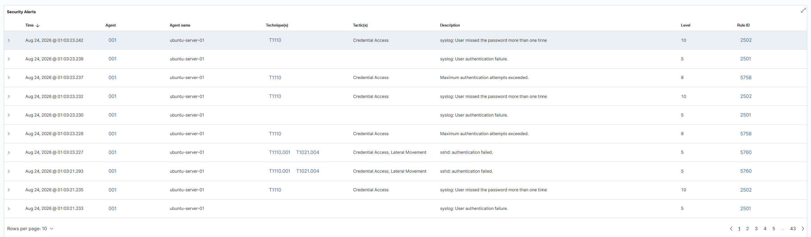
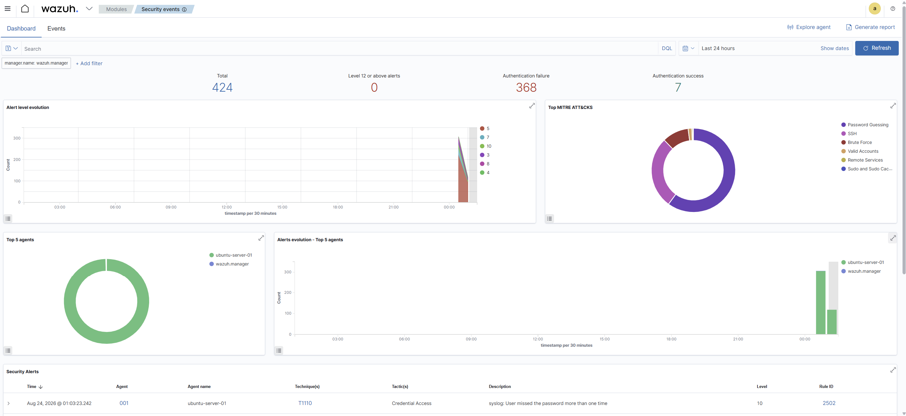

# Home SOC Lab — Threat Detection & Attack Simulation

A home-built Security Operations Center lab for practicing blue team
detection, monitoring, and incident response against simulated attacks.

## Overview

This lab pairs a monitored "defender" host with an isolated "attacker"
host to generate real attack traffic and practice detecting it end to
end — from raw logs, to SIEM alert, to MITRE ATT&CK technique mapping.

## Architecture

```
┌─────────────────────────────┐        ┌─────────────────────────────┐
│   Ubuntu Server 24.04 LTS   │        │      Kali Linux 2026.1       │
│         (Defender)          │        │         (Attacker)          │
│                              │        │                              │
│  Docker + Portainer CE      │◄──────►│  Nmap recon scans           │
│  Wazuh Manager / Indexer /  │  NAT   │  Hydra SSH brute-force      │
│  Dashboard                  │network │  attempts                    │
│  Wazuh Agent (host)         │        │                              │
└─────────────────────────────┘        └─────────────────────────────┘
        Hypervisor: VMware Workstation Pro
        Host: Ryzen 7 5800X / RTX 5070 / 32GB DDR4
        Remote access: Tailscale (SSH + Wazuh dashboard from any device)
```

## What it does

- **Detection & alerting** — Wazuh ingests logs from the defender host
  and the Wazuh agent, alerting on suspicious activity such as
  repeated failed SSH logins and port scan patterns.
- **ATT&CK mapping** — Alerts are automatically mapped to MITRE
  ATT&CK techniques (e.g. T1110 Brute Force, T1046 Network Service
  Discovery) inside the Wazuh dashboard.
- **Attack simulation** — The Kali VM runs realistic reconnaissance
  and brute-force attacks against the defender host to generate
  detectable activity, rather than relying on synthetic test data.
- **Remote access** — Tailscale gives secure access to both VMs and
  the Wazuh dashboard from any device, without exposing anything to
  the public internet.

## Stack

| Component        | Tool                                   |
|-------------------|-----------------------------------------|
| Hypervisor         | VMware Workstation Pro                 |
| Defender OS        | Ubuntu Server 24.04 LTS                |
| Attacker OS        | Kali Linux 2026.1                      |
| SIEM                | Wazuh 4.7.3 (manager, indexer, dashboard) |
| Container runtime   | Docker + Portainer CE                  |
| Attack tools         | Nmap, Hydra                            |
| Remote access         | Tailscale                              |

## Screenshots

**Dashboard overview** — Wazuh detecting a simulated SSH brute-force attack: 424 total alerts, 368 authentication failures, and MITRE ATT&CK technique breakdown (Password Guessing, SSH, Brute Force).



**Alert detail table** — Individual alerts showing technique mapping across the attack, including T1110 (Password Guessing), T1110.001, and T1021.004 (Remote Services / Lateral Movement).



## Status

Actively being extended. In progress / planned:

- [ ] Fix Wazuh Active Response (automatic attacker IP blocking) —
      currently blocked by a suspected Docker container-to-host
      networking issue
- [ ] Add a Wazuh agent on the Kali attacker VM
- [ ] Explore the MITRE ATT&CK dashboard module further
- [ ] Stand up a Metasploitable target VM
- [ ] Run additional attack scenarios: privilege escalation, lateral
      movement, persistence

## Repo contents

- `docker-compose.yml` — sanitized Wazuh stack configuration used on
  the defender VM (internal IPs and secrets removed/replaced with
  placeholders — see comments)
- `docs/` — write-ups and screenshots of alerts, ATT&CK mappings, and
  attack walkthroughs (added as the lab progresses)

## Why this project

Built to get hands-on, practical experience with the core blue team
workflow — deploying a SIEM, generating real attack traffic, tuning
detections, and mapping activity to a recognized threat framework —
as part of my path toward a SOC analyst role.
